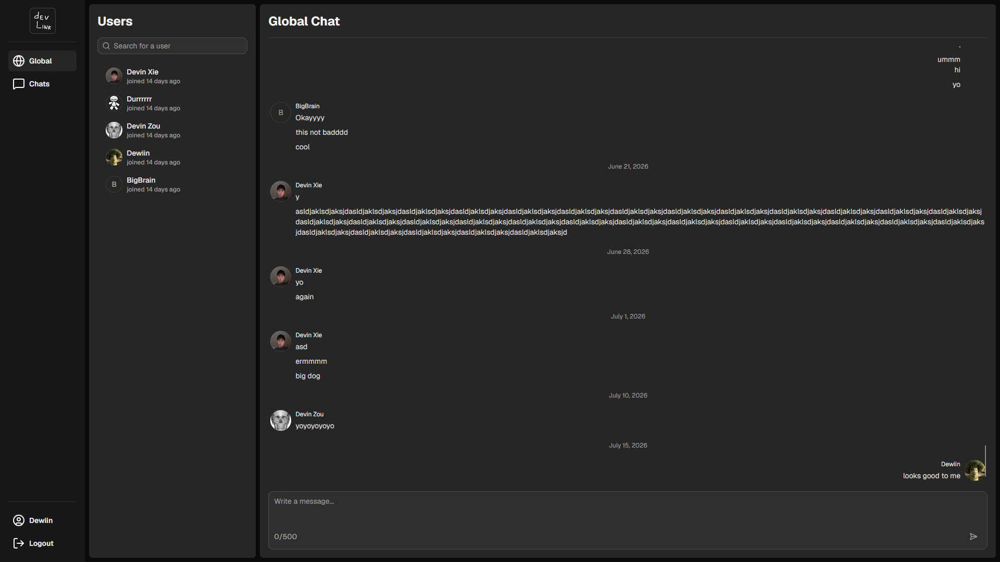
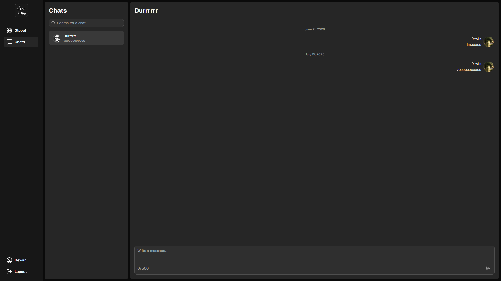
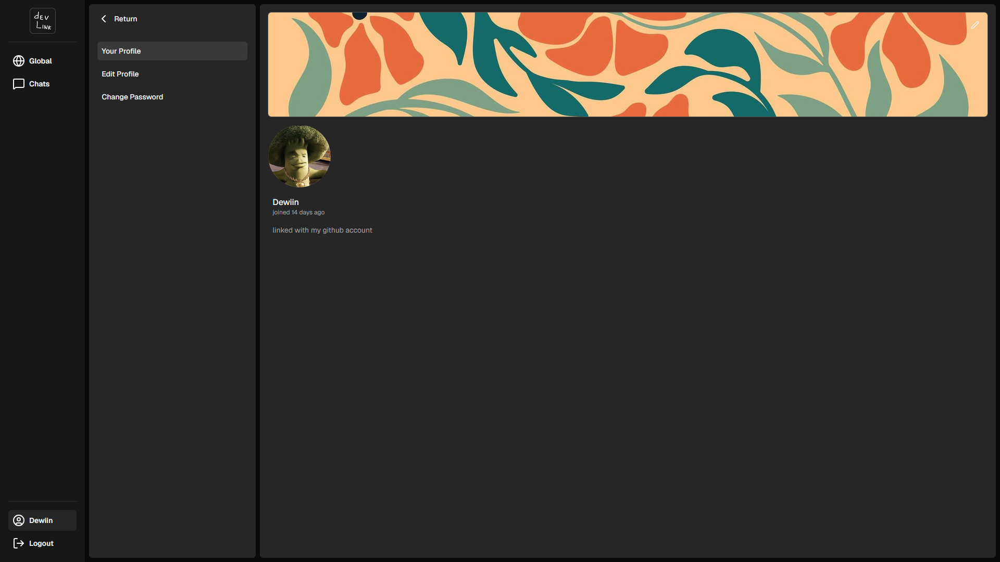

# DevLink

  
  <h1>DevLink</h1>

  

Table of Contents

<ol>
  <li>
    <a href="#introduction">Introduction</a>
    <ul>
      <li><a href="#server">Server</a></li>
    </ul>
  </li>
  <li>
    <a href="#features">Features</a>
    <ul>
      <li><a href="#built-with">Built With</a></li>
    </ul>
  </li>
  <li><a href="#preview">Preview</a></li>
  <li><a href="#contributing">Contributing</a></li>
  <li><a href="#license">License</a></li>
</ol>

## Introduction

DevLink is a full-stack messaging platform built with React, TypeScript, Express, Prisma, and PostgreSQL. It enables users to connect through direct messages and a global community chat while providing a secure authentication system with both local and OAuth login.  
The frontend delivers a responsive chat experience featuring conversation management, user discovery, grouped messages, and a modern interface built with reusable UI components.  

This repository contains the client-side application.

## Server

DevLink's frontend communicates with a separate RESTful API built with Express, Prisma, and PostgreSQL.

- Backend Repository: https://github.com/Dewiin/devlink-api
- Backend Deployment: *Coming Soon*

## Features

- 💬 Messaging
  - Global community chat available to all authenticated users.
  - Private one-on-one conversations between users.
  - Smooth auto-scrolling to the latest messages.

- 🔐 Secure Authentication
  - Google and GitHub OAuth login.
  - JWT authentication with rotating refresh tokens.
  - Secure HttpOnly cookie-based session management.

- 👥 User Discovery
  - Browse all registered users.
  - Search users by display name.
  - Start conversations directly from user profiles.

- 🎨 Responsive UI
  - Clean messaging interface built with reusable components.
  - Mobile-friendly navigation.
  - Built using Tailwind CSS and shadcn/ui.

## Built With

[![React][React]][React-url]
[![TypeScript][TypeScript]][TypeScript-url]
[![React Router][React-router]][React-router-url]
[![React Hook Form][React-hook-form]][React-hook-form-url]
[![Vite][Vite]][Vite-url]
[![shadcn/ui][Shadcn]][Shadcn-url]
[![Tailwind CSS][Tailwind]][Tailwind-url]

<a href="#readme-top">Back to top</a>

## Preview

### Global Chat

### Direct Messages

### User Profile

<a href="#readme-top">Back to top</a>

## Contributing

I enjoy building open-source software and creating applications that solve real-world problems. Contributions of all kinds are welcome, including:

- New features
- Bug fixes
- Performance improvements
- UI/UX enhancements
- Documentation improvements
- Suggestions and feedback

### Here's how you can contribute

1. Fork the repository.
2. Create a feature branch.
3. Commit your changes.
4. Push your branch.
5. Open a pull request.

<a href="#readme-top">Back to top</a>

## License

MIT License

Copyright (c) 2026 Devin

Permission is hereby granted, free of charge, to any person obtaining a copy
of this software and associated documentation files (the "Software"), to deal
in the Software without restriction, including without limitation the rights
to use, copy, modify, merge, publish, distribute, sublicense, and/or sell
copies of the Software, and to permit persons to whom the Software is
furnished to do so, subject to the following conditions:

The above copyright notice and this permission notice shall be included in all
copies or substantial portions of the Software.

THE SOFTWARE IS PROVIDED "AS IS", WITHOUT WARRANTY OF ANY KIND, EXPRESS OR
IMPLIED, INCLUDING BUT NOT LIMITED TO THE WARRANTIES OF MERCHANTABILITY,
FITNESS FOR A PARTICULAR PURPOSE AND NONINFRINGEMENT. IN NO EVENT SHALL THE
AUTHORS OR COPYRIGHT HOLDERS BE LIABLE FOR ANY CLAIM, DAMAGES OR OTHER
LIABILITY, WHETHER IN AN ACTION OF CONTRACT, TORT OR OTHERWISE, ARISING FROM,
OUT OF OR IN CONNECTION WITH THE SOFTWARE OR THE USE OR OTHER DEALINGS IN THE
SOFTWARE.

[React]: https://img.shields.io/badge/React-%2320232a.svg?style=for-the-badge&logo=react&logoColor=%2361DAFB
[React-url]: https://react.dev/

[TypeScript]: https://img.shields.io/badge/TypeScript-3178C6?style=for-the-badge&logo=typescript&logoColor=white
[TypeScript-url]: https://www.typescriptlang.org/

[React-router]: https://img.shields.io/badge/React_Router-CA4245?style=for-the-badge&logo=react-router&logoColor=white
[React-router-url]: https://reactrouter.com/

[React-hook-form]: https://img.shields.io/badge/React%20Hook%20Form-EC5990?style=for-the-badge&logo=reacthookform&logoColor=fff
[React-hook-form-url]: https://react-hook-form.com/

[Vite]: https://img.shields.io/badge/Vite-646CFF?style=for-the-badge&logo=vite&logoColor=fff
[Vite-url]: https://vite.dev/

[Shadcn]: https://img.shields.io/badge/shadcn%2Fui-000?style=for-the-badge&logo=shadcnui&logoColor=fff
[Shadcn-url]: https://ui.shadcn.com/

[Tailwind]: https://img.shields.io/badge/tailwindcss-%2338B2AC.svg?style=for-the-badge&logo=tailwind-css&logoColor=white
[Tailwind-url]: https://tailwindcss.com/